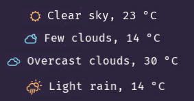

## Welcome

This polybar plugin uses the OpenWeather API to get and display information about your city's current weather. The plugin provides a detailed description of the current weather conditions and the temperature. The icons change according to the local weather conditions, always considering the local sunrise and sunset times. Here a few icons, all opeweathermap conditions are covered.



Typically, you have to get your personal (and free) API key provided by [OpenWeather](at https://openweathermap.org/api).

## Configuration

1. You need to change these values of the script in order to setup the python script.

  ```sh
  CITY = ""
  API_KEY = ""
  UNITS = ""
  UNIT_KEY = ""
  LANG = ""
  ```

The `CITY` needs to be the city ID (i.e. ID of Athens, GR is "264371") of your current city. You can get the CITY ID by searching your city using the [https://openweathermap.org/city/264371](https://openweathermap.org/city/264371) website. It should be the last number digits of the website. 

The `API_KEY` should your personal (and free) key provided by the [OpenWeather](https://openweathermap.org/api).

The `UNITS` field can be either `Metric` or `Imperial` for Celcius or Fahrenheit units, respectively. Then change the `UNIT_KEY` accordingly to "C" or "F".

Finally, the language field `LANG`, can be set to your native language if prefered. Take a look at the [supported languages](https://openweathermap.org/current#multi) with the corresponded `LANG` values.

2. Clone the repository and copy the script to your polybar script folder
  ```sh
  # Clone the repository
  git clone https://github.com/gcharalampous/weather-icon-polybar
  cd weather-icom-polybar
  # Copy the script to /your/polybar/scripts/folder
  cp weather-icons.sh /your/polybar/scripts/folder
  ```
3. Don't forget to make the script executable
  ```sh
  # Make the polybar script executable
  chmod +x /your/polybar/scripts/folder/weather-icons.sh
  ```
4. Add the following code to your polybar config.ini file
  ```sh
  [module/weather-icons]
  type = custom/script
  interval = 10
  exec = ~/.config/polybar/scripts/weather-icons.sh
  tail = true
  click-left= exec $BROWSER https://openweathermap.org/city/264371
 ```
 5. Finally, add the plug-in to your polybar panel
